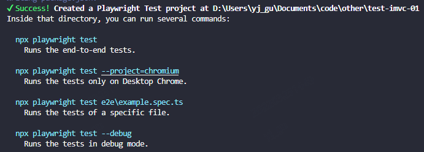
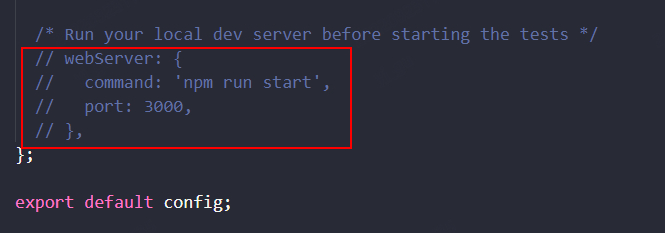
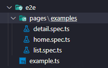
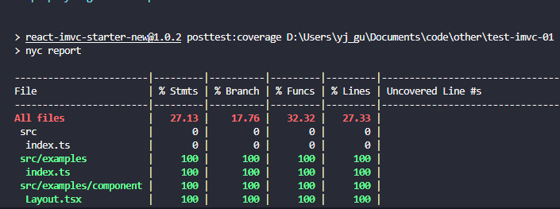

# react-imvc 端到端测试环境搭建教程

### 版本要求

升级 `react-imvc` 版本到以下版本：

- 2.0 用户，升级 `react-imvc` 版本 >= `2.9.1`
- 3.0 用户，升级 `react-imvc` 版本 >= `3.2.2`

### 安装 playwright

执行命令：

```sh
npx playwright init
```

建议选择 TypeScript


下一步，建议测试目录名称为 `e2e`，跟单元测试的 `test/tests` 分开。


继续走后续选项流程，最后成功状态应为：



项目里将增加：

- `e2e/` 目录，里面有 `example.spec.ts` 样例代码
- `playwright.config.ts` 配置文件
- `package.json` 更新了相关依赖

执行命令：

```sh
npx playwright test
```

如果失败，报以下问题：


`browserContext.newPage: Browser closed.` 错误通常是 `chromium` 启动有问题。请重启电脑后，再次执行命令。

如果一直有这个问题，建议在 `playwright.config.ts` 修改 `projects` 配置，把 `chromium` 注释掉，选择或保留 `firefox` 等浏览器。


成功后得到如下提示。


### 安装其它依赖和配置

```sh
npm install --save-dev nyc rimraf
```

- nyc：用以代码覆盖率检测
- rimraf：用以删除测试输出的文件目录

添加 `nyc.config.js` 文件，复制以下代码到该文件：

```js
module.exports = {
  /**
   * 要测试的文件目录
   */
  include: ['src/**'],
};
```

更多配置项[点击这里](https://github.com/istanbuljs/nyc#common-configuration-options)

下一步，添加以下 `scripts` 配置到 package.json

```json
{
  "scripts": {
    "posttest:coverage": "nyc report",
    "pretest:coverage": "rimraf coverage playwright-report .nyc_output",
    "test:coverage": "playwright test"
  }
}
```

下一步，修改 `playwright.config.ts` 文件。



解除最下方的 `webServer` 配置的注释，替换为以下代码：

```js
{
  webServer: {
    /**
     * 测试之前，启动本地 server
     */
    command: 'npm start',
    /**
     * 等待目标 url 200 响应后再开始测试
     */
    url: 'http://localhost:3000/slbhealthcheck.html',
    /**
     * 如果本地已经启动了服务，则复用该服务
     */
    reuseExistingServer: true,
    /**
     * 注入环境变量，通过 react-imvc 开启覆盖率检测的编译选项
     */
    env: {
      USE_COVERAGE: '1',
    },
  }
}
```

下一步，调整 `e2e/` 目录下的文件

- `example.spec.ts` 改为 `example.ts`，使之不参与测试，仅作为 playwright 测试用例参考
- 新增你的页面 `{page}.spec.ts` 文件，编写你的 playwright 测试用例

注意，`test` 函数需要从 `react-imvc/playwright` 中引入，代替 `playwright` 提供的。如下所示：

```tsx
/**
 * 用 react-imvc/playwright 的 test 函数
 * 用法和 playwright 相同
 */
import { test } from 'react-imvc/playwright'
import { expect } from '@playwright/test';

test.describe('examples-home', () => {
  test('render', async ({ page }) => {
    await page.goto(`http://localhost:3000/examples`)
    await page.waitForSelector('.new_index_search')

    const icons = await page.$$('.icon')

    expect(icons.length).toBe(9)
  })
})
```

可以访问 [playwright 官方文档](https://playwright.dev/docs/intro)，了解更多端到端测试的相关知识。



下一步，运行以下命令：

```sh
npm run test:coverage
```

如端到端测试通过，我们最终可以看到代码覆盖率的结果，如下图：

